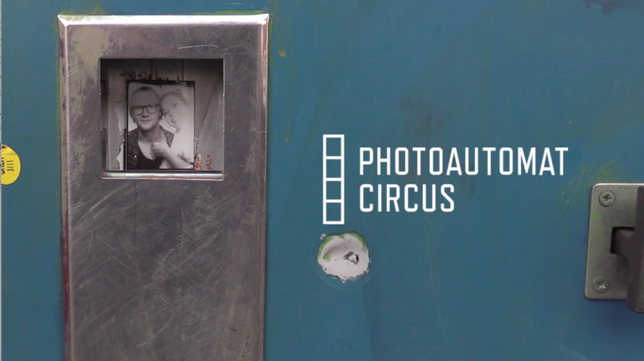

Photoautomat Circus
===================

Photoautomat Circus is a collaborative project made over three days as part of the [Dok Hackathon Berlin](http://www.netzdoku.org/2014/09/21/dok-hackathon-berlin/), _Oct. 3-5, 2014_.

http://vied12.github.io/photoautomat-circus/



## Team Vier

- Adrien Tasic - _Illustrator, Animator_
- Edouard Richard - _Developer_
- Olivier Guillard - _Webdesigner_
- Elizabeth Grenier _Filmmaker_
- Rick Minnich - _Filmmaker_
- Olivier Chardin - _Musik_


## Installation

**1. Prerequisite**
```bash
sudo apt-get install build-essential git-core python python-pip python-dev sass
sudo pip install virtualenv
```

and __sass__

**2.  Download the project**
```bash
git clone git@github.com:vied12/photoautomat-circus.git
cd photoautomat-circus
```

**3. Install**
```bash
make install
```

## Run in development

```bash
make run
```

Then visit [http://127.0.0.1:5000](http://127.0.0.1:5000)

## Generate static files

You have to add a BASE_URL to generate some absolute urls.

```bash
make freeze BASE_URL=http://vied12.github.io/photoautomat-circus/
```
